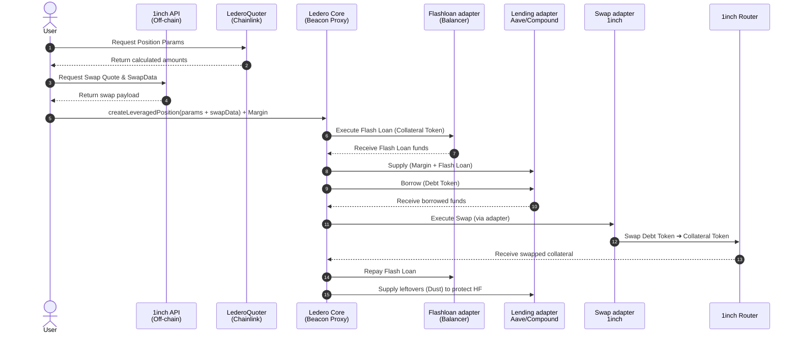
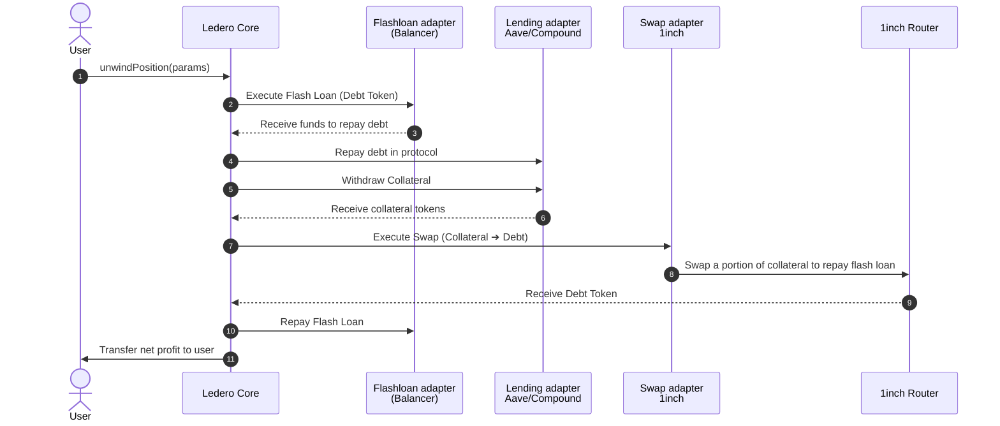

# Ledero: Leverage Defi Router

**Ledero is a one-transaction leverage engine that compresses complex DeFi operations into a single atomic call. It aims to make sophisticated strategies accessible, cheaper, and safer.**

Typically, opening a leveraged position requires a user to manually execute 5-10 transactions: deposit collateral -> borrow assets -> swap -> deposit again. Ledero abstracts this entire process. By utilizing **flash loans**, the protocol borrows the required funds upfront to instantly create the desired leverage, allowing users to multiply their exposure to an asset without needing the full upfront capital.

For a deep dive into the protocol mechanics, please refer to the [Detailed Documentation](DOCUMENTATION.md).

---

## 🚀 Opening a Position (Create Position)

The process automates calculations and swapping to maximize your capital efficiency.

### Example in Numbers:
1. **Preparation**: You have **1 WETH** ($3,000), and you want **x2** leverage.
2. **Flash Loan**: Ledero executes a flash loan for **1 WETH**.
3. **Supply**: A total of **2 WETH** (your 1 + 1 from the flash loan) is supplied to Aave V3.
4. **Borrow**: The protocol borrows **$3,000 USDC** against the 2 WETH collateral.
5. **Swap**: The $3,000 USDC is swapped via 1inch back into **1 WETH**.
6. **Repay**: The obtained 1 WETH is returned to Balancer to repay the flash loan.
**Result**: In a single transaction, you hold a position of **2 WETH** with a debt of only **$3,000 USDC**.

---

## 📉 Closing a Position (Unwind Position)

Allows you to lock in profits or save a position from liquidation. Let's assume that during the holding period, the price of WETH increased by **50%** (from $3,000 to $4,500).

### Example in Numbers (assuming a 50% price increase):
1. **State**: You have 2 WETH ($9,000) in collateral and $3,000 of debt in USDC.
2. **Flash Loan**: Ledero executes a **$3,000 USDC** flash loan.
3. **Repay & Withdraw**: The debt in Aave is repaid, and Ledero withdraws all **2 WETH**.
4. **Swap**: The protocol swaps a portion of the collateral (**~0.67 WETH**) back into **$3,000 USDC**.
5. **Repay**: The $3,000 USDC is returned to Balancer.
6. **Profit**: The user receives the remaining **1.33 WETH** (valued at **$6,000**) in their wallet.
**Benefit**: The net profit is **100%** ($3,000) while the asset only grew by **50%**, and all unwinding actions took just 1 atomic transaction.

---

## ✨ Key Features

* **Position Migration**: Instantly migrate positions between protocols (e.g., from Aave V3 to Compound V3) in a single transaction to capture better APR or incentives.
* **Hybrid Control (Manual Management)**: Ledero provides full manual control over your positions via `supplyCollateral`, `borrowDebt`, `repayDebt`, and `claimProtocolRewards` functions.
* **Modular Calldata Architecture**: All adapter addresses are passed directly via `calldata`, allowing them to be easily replaced or upgraded if necessary without core contract modification.

---

## 🤝 Integrations with protocols
* **Lending**: Aave V3 and Compound V3.
* **Flash Loans**: Balancer V3 (0% fee).
* **Swaps**: 1inch Aggregator.

## 🏗 Architecture
* **Stateless & Modular Adapters**: All protocol-specific logic is isolated into standalone adapter contracts. This modularity enables connecting new protocols without needing to redeploy the core engine.
* **Transient Storage (EIP-1153)**: Employs `TSTORE`/`TLOAD` for secure and ultra-cheap execution context passing during flash loan callbacks without touching persistent storage.
* **Vanity Addresses**: To prevent accidental user errors, CREATE2 is used with strict prefix verification. Valid adapter addresses **must start with 0x0000** followed by a specific hex prefix (1 — Lending, 2 — Flash, 3 — Swap).
* **Upgradability**: The system is built on a **Beacon Proxy** pattern utilizing a Namespaced Storage Layout, completely eliminating storage collisions during future upgrades.

## 🧪 Testing
The protocol is built with an auditor's mindset and rigorously tested:
* **Mainnet Fork**: Tests run against a live Ethereum Mainnet fork to interact with real liquidity.
* **Unit Tests & Mocks**: Core functions are isolated and tested using dedicated Mock contracts.
* **Advanced Testing**: Implements Stateful Fuzzing and Invariant Testing (Handler-based) to ensure system stability.
* **Coverage**: 100% code coverage for all files in the project.

## ⚠️ Current Constraints
* **Network**: Ethereum Mainnet.
* **Tokens**: Supports standard ERC-20 tokens (requires `decimals()` function).

## 🗺 Roadmap
- [ ] **Permit2** integration for seamless UX without extra approvals.
- [ ] L2 Network Expansion (Arbitrum, Optimism).
- [ ] Calldata gas optimizations.
- [ ] Custom Dispatcher & Hooks for third-party developers.
- [ ] On-chain verification of adapter hashes.