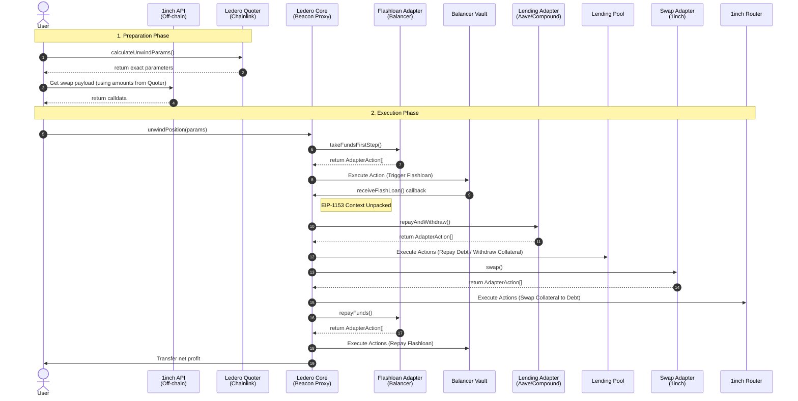

# Ledero: Leverage Defi Router

**Ledero is a one-transaction leverage engine that compresses complex DeFi operations into a single atomic call. It aims to make sophisticated strategies accessible, cheaper, and safer.**

Typically, opening a leveraged position requires a user to manually execute 5-10 transactions: deposit collateral -> borrow assets -> swap -> deposit again. Ledero abstracts this entire process. By utilizing **flash loans**, the protocol borrows the required funds upfront to instantly create the desired leverage, allowing users to multiply their exposure to an asset without needing the full upfront capital.

For a deep dive into the protocol mechanics, please refer to the [Detailed Documentation](DOCUMENTATION.md).

---

## 🚀 Opening a Position (Create Position)

The process automates calculations and swapping to maximize your capital efficiency.

### Example in Numbers:

1. **Preparation**: You have **1 WBTC** ($65,000), and you want **2x** leverage.
2. **Flash Loan**: Ledero executes a flash loan for **1 WBTC**.
3. **Supply**: A total of **2 WBTC** (your 1 WBTC + 1 WBTC from the flash loan) is supplied to Aave V3.
4. **Borrow**: The protocol borrows **$65,000 USDC** against your 2 WBTC collateral.
5. **Swap**: The $65,000 USDC is swapped via 1inch back into **1 WBTC**.
6. **Repay**: The obtained 1 WBTC is returned to Balancer to repay the flash loan.

## **Result**: In a single transaction, you hold a position of **2 WBTC** (worth $130,000) with a debt of only **65,000 USDC**. Your net equity remains $65,000, but your market exposure is doubled!

## 📉 Closing a Position (Unwind Position)

Allows you to lock in profits or save a position from liquidation. Let's assume that during the holding period, the price of WBTC increased by **50%** (from $65,000 to $97,500).

### Example in Numbers:

1. **State**: You have **2 WBTC** (now worth $195,000) in collateral and **$65,000** of debt in USDC.
2. **Flash Loan**: Ledero executes a **$65,000 USDC** flash loan.
3. **Repay & Withdraw**: The debt in Aave is repaid, and Ledero withdraws all **2 WBTC**.
4. **Swap**: The protocol swaps a portion of the collateral (**~0.67 WBTC**) back into **$65,000 USDC** (since 1 WBTC is now $97,500).
5. **Repay**: The $65,000 USDC is returned to Balancer to repay the flash loan.
6. **Profit**: The user receives the remaining **~1.33 WBTC** (valued at **$130,000**) in their wallet.

## **Benefit**: Your net equity grew from $65,000 to $130,000. The net profit is **100%** ($65,000) while the underlying asset only grew by **50%**, and all unwinding actions took just 1 atomic transaction.

## ✨ Key Features

- **Position Migration**: Instantly migrate positions between protocols (e.g., from Aave V3 to Compound V3) in a single transaction to capture better APR or incentives.
- **Hybrid Control (Manual Management)**: Ledero provides full manual control over your positions via `supplyCollateral`, `borrowDebt`, `repayDebt`, and `claimProtocolRewards` functions.
- **Modular Calldata Architecture**: All adapter addresses are passed directly via `calldata`, allowing them to be easily replaced or upgraded if necessary without core contract modification.

---

## 🤝 Integrations with protocols

- **Lending**: Aave V3 and Compound V3.
- **Flash Loans**: Balancer V3 (0% fee).
- **Swaps**: 1inch Aggregator.

## 🏗 Architecture

- **Stateless & Modular Adapters**: Adapters are purely analytical. They calculate required steps and return an array of `AdapterAction` structs. The `Ledero Core` acts as the sole **Action Executor**, executing these commands safely.
- **Transient Storage (EIP-1153)**: Employs `TSTORE`/`TLOAD` for secure and ultra-cheap execution context passing during flash loan callbacks without touching persistent storage.
- **Vanity Addresses**: To prevent accidental user errors, CREATE2 is used with strict prefix verification. Valid adapter addresses **must start with 0x0000** followed by a specific hex prefix (1 — Lending, 2 — Flash, 3 — Swap).
- **Upgradability**: The system is built on a **Beacon Proxy** pattern utilizing a Namespaced Storage Layout, completely eliminating storage collisions during future upgrades.

## 🧪 Testing

The protocol is built with an auditor's mindset and rigorously tested:

- **Mainnet Fork**: Tests run against a live Ethereum Mainnet fork to interact with real liquidity.
- **Unit Tests & Mocks**: Core functions are isolated and tested using dedicated Mock contracts.
- **Advanced Testing**: Extensive use of stateless Fuzzing (via vm.assume and bound) to ensure mathematical boundaries and system stability.
- **Coverage**: 100% code coverage for all files in the project.

## ⚙️ CI/CD & Automated Pipeline

The repository includes a production-grade GitHub Actions pipeline designed with smart contract security and continuous deployment best practices in mind:

- **Automated Testing & Gas Profiling:** On every pull request, the CI pipeline triggers a comprehensive Mainnet fork testing suite via Foundry to validate production liquidity routes. It enforces a strict **100% code coverage** standard for all core contracts and automatically generates gas snapshots, tracking efficiency regressions across protocol upgrades before any code is merged into the main branch.
- **Linter & Static Analysis:** Continuous integration runs strict code quality checks using `solhint` and built-in `forge lint` rules, verifying formatting consistency and code safety before any merge.
- **Continuous Deployment (CD):** Features a custom `workflow_dispatch` pipeline for manual, secure testnet upgrades. The script atomically deploys new `Ledero` implementation logic, securely updates the `UpgradeableBeacon` proxy context using GitHub repository secrets, and handles contract verification on block explorers.
- **Resilient Verification Wrapper:** To tackle blockchain explorer indexing latency, the deployment pipeline incorporates a resilient bash-loop wrapper around `forge verify-contract --watch`, automatically retrying verification processes with fixed cooling periods until the source code is successfully verified.

## ⚠️ Current Constraints

- **Network**: Ethereum Mainnet.
- **Tokens**: Supports standard ERC-20 tokens (requires `decimals()` function).

## 🗺 Roadmap

- [ ] Permit2 integration for seamless UX without extra approvals.
- [ ] L2 Network Expansion (Arbitrum, Optimism).
- [ ] Calldata gas optimizations.
- [ ] Custom Dispatcher & Hooks for third-party developers.
- [ ] On-chain verification of adapter hashes.
